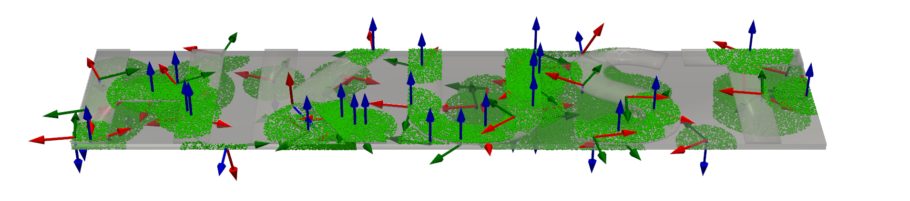

# TACTO Pro


TACTO Pro is a lightweight wrapper designed to streamline the creation of TACTO simulations, significantly reducing code complexity and boilerplate. It supports Python versions 3.9 through 3.12 (current `open3d` does not supoort 3.13).

With `tactopro`, there's no need to manually interact with the `tacto` package or write extensive custom code to sample tactile images. Simply follow this workflow:

```python
from tactopro import TactoPro, TactoConfig

tp = TactoPro("public/hkust.stl", config=TactoConfig())
frames = tp.sample_frames_uniformly(500)
tp.save(frames, "public/hkust")
```

After running the `example.py`, you'll get results similar to the following:

<p align="center"> 
    
    
</p>

## Setup

You can install TACTO Pro using pip:

```sh
pip install tactopro@git+https://github.com/ZhangzrJerry/TactoPro.git
```

Alternatively, clone the repository and install it manually:

```sh
git clone https://github.com/ZhangzrJerry/TactoPro && cd TactoPro
pip install -e .
```

## License

This project is licensed under the MIT License, as detailed in the [LICENSE](./LICENSE) file.

Most visualization utilities and rendering functions are adapted from [MidasTouch](https://github.com/facebookresearch/MidasTouch), which is primarily distributed under the MIT License.
